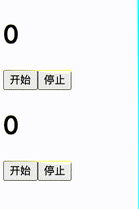

<!--
 * Author  rhys.zhao
 * Date  2023-06-02 09:53:34
 * LastEditors  rhys.zhao
 * LastEditTime  2023-06-05 18:20:47
 * Description
-->

# useRef

## 基本用法

提起 `useRef`，很多人都会把它跟 DOM 联系起来。其实 useRef 不止可以用来存储 DOM 元素。它的定义是：

**如果希望组件记住某些信息，但又不想让这些信息触发新的渲染，可以使用 useRef。**

比如下面这个[例子](https://codesandbox.io/s/useref-timer-ntuhde?file=/src/App.js)：

```js
import React, { useState, useEffect } from 'react';

let timer = null;

function Counter() {
  const [count, setCount] = useState(0);

  const onStart = () => {
    timer = setInterval(() => {
      setCount((count) => count + 1);
    }, 1000);
  };

  const onStop = () => {
    clearInterval(timer);
  };

  useEffect(() => {
    return () => {
      clearInterval(timer);
    };
  }, []);

  return (
    <>
      <h1>{count}</h1>
      <button onClick={onStart}>开始</button>
      <button onClick={onStop}>停止</button>
    </>
  );
}
```

这个例子里，我们写了一个 `Counter` 组件。点击开始按钮 `count` 每秒增加 1，点击停止按钮 `count` 停止增加。

看上去，这个组件好像很 OK。

但是如果在一个页面使用 Counter 组件两次，就会发现，第一个定时器停止不了。

```js
export default function App() {
  return (
    <div className='App'>
      <Counter />
      <Counter />
    </div>
  );
}
```

如下图：



这是因为两个组件公用同一个 `timer` 变量，第二个组件修改 `timer` 后，导致第一个组件中 `clearInterval` 处理的是第二个组件的 `timer`。 因此第一个组件无法停止定时增加。

官网推荐我们**使用纯函数编写组件**也是基于此。

估计有人会说，我可以把 `timer` 变量放到 `Counter` 内部。组件内部的变量是互相隔离的, 这样就不会把第一个 Counter 组件的 `timer` 给覆盖了。

放到内部有两种情况：

**1. 直接使用变量。** 当组件更新的时候，组件函数重新执行，会导致 `timer` 重新创建，因此并不能清除之前的 `timer`。

**2. 使用 state。** 使用 state 可以解决问题，但是会导致不必要的渲染。每次 `timer` 变化都会导致组件重新渲染。

其实对于这种定时器清理的问题，我们可以使用 useRef。useRef 创建一个变量，变量里有一个 current 属性。

```js
const timeRef = useRef(null);
```

比如上面这段代码，会创建一个变量 timeRef, 它的结构类似 `{ current: null }`。

使用 ref 修改上述例子中的代码：

```js
function Counter() {
  const [count, setCount] = useState(0);
  const timeRef = useRef(null);

  const onStart = () => {
    timeRef.current = setInterval(() => {
      setCount((count) => count + 1);
    }, 1000);
  };

  const onStop = () => {
    clearInterval(timeRef.current);
  };

  useEffect(() => {
    return () => {
      clearInterval(timeRef.current);
    };
  }, []);

  return (
    <>
      <h1>{count}</h1>
      <button onClick={onStart}>开始</button>
      <button onClick={onStop}>停止</button>
    </>
  );
}
```

运行试试，完美解决了之前的问题。

可以这样理解，**ref 跟 state 的区别是，ref 不会导致组件重新渲染。**

## 使用 ref 操作 DOM

我们来看一个 ref 操作 DOM 的[例子](https://codesandbox.io/s/3htdyg?file=%2FApp.js&utm_medium=sandpack)：

```js
import { useRef } from 'react';

export default function Form() {
  const inputRef = useRef(null);

  function handleClick() {
    inputRef.current.focus();
  }

  return (
    <>
      <input ref={inputRef} />
      <button onClick={handleClick}>聚焦输入框</button>
    </>
  );
}
```

效果：点击聚焦输入框按钮，输入框将会聚焦。

这段代码主要做了以下事情：

1. 使用 `useRef` Hook 声明 `inputRef`。
2. `<input ref={inputRef}>` 告诉 React 将这个 input 的 DOM 节点放入 `inputRef.current`。
3. 在 `handleClick` 函数中，从 `inputRef.current` 读取 input DOM 节点并调用它的 `focus()`。
4. 给按钮添加点击事件`handleClick`

## forwardRef
