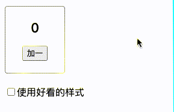
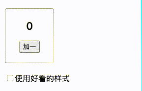

<!--
 * Author  rhys.zhao
 * Date  2023-06-02 09:53:42
 * LastEditors  rhys.zhao
 * LastEditTime  2023-06-07 17:17:48
 * Description
-->

# useState

## 渲染和提交

在 React 应用中一次屏幕更新都会发生以下三个步骤：

**1. 触发**

也就说触发一次渲染。有两种原因会导致组件渲染：

- **组件的初次渲染**: 当应用启动时，会触发初次渲染。也就是 `render` 方法的执行。

```js
import Image from './Image.js';
import { createRoot } from 'react-dom/client';

const root = createRoot(document.getElementById('root'));
root.render(<Image />); // 初次渲染
```

- **组件或者其祖先的状态发生了改变**

一旦组件被初始渲染后，我们可以通过 `set函数`**更新组件状态**来触发之后的渲染。

**2. 渲染**

在我们触发渲染后，React 会调用组件来确定要在屏幕上显示的内容。`渲染中` 即 React 在调用你的组件函数。

- **在进行初次渲染时, React 会调用根组件。**

- **对于后续的渲染, React 会调用内部状态更新触发了渲染的函数组件。**

**3. 提交**

在渲染（调用）您的组件之后，React 将会修改 DOM。

- 对于初次渲染， React 会使用 `appendChild()` DOM API 将其创建的所有 DOM 节点放在屏幕上。

- 对于再次渲染， React 将应用最少的必要操作（在渲染时计算），以使得 DOM 与最新的渲染输出相互匹配。

  **React 仅在渲染之间存在差异时才会更改 DOM 节点。** 如果渲染结果与上次一样，那么 React 将不会修改 DOM。

在渲染完成并且 React 更新 DOM 之后，浏览器就会重新绘制屏幕。

## useState Hook

使用 state 需要注意以下几点：

- 当一个组件需要在**多次渲染记住某些信息**时，使用 state 变量。

- 调用 Hook 时，包括 useState，仅在组件或者另一个 Hook 的**顶层作用域**调用。

- state 是**隔离且私有**的。也就是说，将一个组件调用两次，他们内部的 state 不会互相影响。

### 1. state 如同一张快照

当 React 重新渲染一个组件时：

1. React 会再次调用你的函数
2. 你的函数会返回新的 JSX 快照
3. React 会更新界面来匹配你返回的快照

> 作为一个组件的记忆，state 不同于在你的函数返回之后就会消失的普通变量。state 实际上“活”在 React 本身中——就像被摆在一个架子上！——位于你的函数之外。当 React 调用你的组件时，它会为特定的那一次渲染提供一张 state 快照。你的组件会在其 JSX 中返回一张包含一整套新的 props 和事件处理函数的 UI 快照 ，其中所有的值都是 根据那一次渲染中 state 的值 被计算出来的！

```js
import { useState } from 'react';

export default function Counter() {
  const [number, setNumber] = useState(0);

  return (
    <>
      <h1>{number}</h1>
      <button
        onClick={() => {
          setNumber(number + 1);
          setNumber(number + 1);
          setNumber(number + 1);
        }}>
        +3
      </button>
    </>
  );
}
```

以下是这个按钮的点击事件处理函数通知 React 要做的事情：

1. `setNumber(number + 1)`：`number` 是 0 所以 `setNumber(0 + 1)`。
   React 准备在下一次渲染时将 `number` 更改为 1。
2. `setNumber(number + 1)`：`number` 是 0 所以 `setNumber(0 + 1)`。
   React 准备在下一次渲染时将 `number` 更改为 1。
3. `setNumber(number + 1)`：`number` 是 0 所以 `setNumber(0 + 1)`。
   React 准备在下一次渲染时将 `number` 更改为 1。

尽管你调用了三次 `setNumber(number + 1)`，但在这次渲染的 事件处理函数中 `number` 会一直是 0，所以你会三次将 state 设置成 1。这就是为什么在你的事件处理函数执行完以后，React 重新渲染的组件中的 `number` 等于 1 而不是 3。

为了更好理解，我们看下面这个例子：

```js
import { useState } from 'react';

export default function Counter() {
  const [number, setNumber] = useState(0);

  return (
    <>
      <h1>{number}</h1>
      <button
        onClick={() => {
          setNumber(number + 5);
          setTimeout(() => {
            alert(number);
          }, 3000);
        }}>
        +5
      </button>
    </>
  );
}
```

点击+5 后，弹出的数字是 0，而不是 5. 点击按钮后的操作：

1. `setNumber(0+5)`
2. `js
setTimeout(() => {
    alert(0)
})`

### 2. 将 state 加入队列

React 会对 state 更新进行批处理。在上面的示例中，连续调用了三次`setNumber(number + 1)`并不能得到我们想要的结果。

**React 会等到事件处理函数中的所有代码都运行完毕再处理你的 state 更新。**

我们可以通过更新函数来在下次渲染之前多次更新同一个 state。比如：

```js
import { useState } from 'react';

export default function Counter() {
  const [number, setNumber] = useState(0);

  return (
    <>
      <h1>{number}</h1>
      <button
        onClick={() => {
          setNumber((n) => n + 1);
          setNumber((n) => n + 1);
          setNumber((n) => n + 1);
        }}>
        +3
      </button>
    </>
  );
}
```

下面是 React 在执行事件处理函数时处理这几行代码的过程：

1. `setNumber(n => n + 1)`：`n => n + 1` 是一个函数。React 将它加入队列。
2. `setNumber(n => n + 1)`：`n => n + 1` 是一个函数。React 将它加入队列。
3. `setNumber(n => n + 1)`：`n => n + 1` 是一个函数。React 将它加入队列。

当你在下次渲染期间调用 useState 时，React 会遍历队列。之前的 number state 的值是 0，所以这就是 React 作为参数 n 传递给第一个更新函数的值。然后 React 会获取你上一个更新函数的返回值，并将其作为 n 传递给下一个更新函数，以此类推：
|更新队列|n|返回值|
|:--------|:-------:|-------:|
|n => n + 1|0|0 + 1 = 1|
|n => n + 1|1|1 + 1 = 2|
|n => n + 1|2|2 + 1 = 3|

看看下面这个例子：

```js
import { useState } from 'react';

export default function Counter() {
  const [number, setNumber] = useState(0);

  return (
    <>
      <h1>{number}</h1>
      <button
        onClick={() => {
          setNumber(number + 5);
          setNumber((n) => n + 1);
          setNumber(42);
        }}>
        增加数字
      </button>
    </>
  );
}
```

以下是 React 在执行事件处理函数时处理这几行代码的过程：

1. `setNumber(number + 5)`：`number` 为 0，所以 `setNumber(0 + 5)`。React 将 “替换为 5” 添加到其队列中。
2. `setNumber(n => n + 1)`：`n => n + 1` 是一个更新函数。React 将该函数添加到其队列中。
3. `setNumber(42)`：React 将 “替换为 42” 添加到其队列中。

在下一次渲染期间，React 会遍历 state 队列：
|更新队列|n|返回值|
|:--------|:-------:|-------:|
|替换为 5|0|5|
|n => n + 1|5|5 + 1 = 6|
|替换为 42|6|42|

可以这样来理解状态队列的更新：

```js
function getFinalState(baseState, queue) {
  let finalState = baseState;
  queue.forEach((update) => {
    finalState = typeof update === 'function' ? update(finalState) : update;
  });
  return finalState;
}
```

其中 baseState 是初始状态，queue 是状态更新队列，包括数据和更新函数。

### 3. set 函数一定会触发更新吗？

看下面这个例子：

```js
export default function Counter() {
  const [number, setNumber] = useState(0);
  const [person, setPerson] = useState({ name: 'jack' });
  console.log('渲染');

  return (
    <>
      <button
        onClick={() => {
          setNumber(number);
        }}>
        增加数字
      </button>
      <h1>{number}</h1>
      <button
        onClick={() => {
          person.age = 18;
          setPerson(person);
        }}>
        修改对象
      </button>
      <h1>{JSON.stringify(person)}</h1>
    </>
  );
}
```

组件的更新意味着组件函数的重新执行。对于上面这个例子，无论是点击 `增加数字` 还是 `改变对象` 都没有打印 `渲染`。

set 函数触发更新的条件：

- **值类型，state 的值改变**
- **引用类型，state 的引用改变**

对于上面的例子：

- number 是值类型。点击增加数字，值没有改变，不会触发更新。
- person 是引用类型。点击修改对象，虽然 person 对象的值虽然变化了，但是引用地址没有变化，因此也不会触发更新。

### 4. 构建 state 的原则

1. 合并关联的 state

有时候我们可能会不确定使用单个 state 还是多个 state 变量。

```js
const [x, setX] = useState(0);
const [y, setY] = useState(0);
```

或

```js
const [position, setPosition] = useState({ x: 0, y: 0 });
```

从技术上讲，你可以使用其中任何一种方法。但是，**如果某两个 state 变量总是一起变化，则将它们统一成一个 state 变量可能更好**。这样你就不会忘记让它们始终保持同步。

2. 避免矛盾的 state

```js
import { useState } from 'react';

export default function Send() {
  const [isSending, setIsSending] = useState(false);
  const [isSent, setIsSent] = useState(false);
  return (
    <>
      <button
        onClick={() => {
          setIsSent(false);
          setIsSending(true);
          setTimeout(() => {
            setIsSending(false);
            setIsSent(true);
          }, 2000);
        }}>
        发送
      </button>
      {isSending && <h1>正在发送...</h1>}
      {isSent && <h1>发送完成</h1>}
    </>
  );
}
```

尽管这段代码是有效的，但也会让一些 state “极难处理”。例如，如果你忘记同时调用 `setIsSent` 和 `setIsSending`，则可能会出现 二者 同时为 true 的情况。

可以用一个 status 变量来代替它们。代码如下：

```js
import { useState } from 'react';

export default function Send() {
  const [status, setStatus] = useState('init');
  return (
    <>
      <button
        onClick={() => {
          setStatus('sending');
          setTimeout(() => {
            setStatus('sent');
          }, 2000);
        }}>
        发送
      </button>
      {status === 'sending' && <h1>正在发送...</h1>}
      {status === 'sent' && <h1>发送完成</h1>}
    </>
  );
}
```

3. 避免冗余的 state

```js
import { useState } from 'react';

export default function Name() {
  const [firstName, setFirstName] = useState('');
  const [lastName, setLastName] = useState('');
  const [fullName, setFullName] = useState('');

  return (
    <>
      <span>First Name</span>
      <input
        value={firstName}
        onChange={(e) => {
          setFirstName(e.target.value);
          setFullName(e.target.value + ' ' + lastName);
        }}
      />
      <span>Last Name</span>
      <input
        value={lastName}
        onChange={(e) => {
          setLastName(e.target.value);
          setFullName(firstName + ' ' + e.target.value);
        }}
      />
      <h1>{fullName}</h1>
    </>
  );
}
```

能够看出，fullName 是冗余的 state。我们可以直接：

```js
const fullName = firstName + ' ' + lastName;
```

无需再把 fullName 存放到 state 中。

4. 避免重复的 state

有时候，在我们存储的 state 中，可能有两个 state 有重合的部分。这时候我们就要考虑是不是有重复的问题了。

具体例子见[这里](https://react.docschina.org/learn/choosing-the-state-structure#avoid-duplication-in-state)

### 5. 保存和重置 state

前面我们说过，组件内部的 state 是互相隔离的。一个组件 state 的改变不会影响另外一个。然而，我们看下面这个[例子](https://codesandbox.io/s/kz8tr8?file=%2FApp.js&utm_medium=sandpack)：

```js{7}
import { useState } from 'react';

export default function App() {
  const [isFancy, setIsFancy] = useState(false);
  return (
    <div>
      {isFancy ? <Counter isFancy={true} /> : <Counter isFancy={false} />}
      <label>
        <input
          type='checkbox'
          checked={isFancy}
          onChange={(e) => {
            setIsFancy(e.target.checked);
          }}
        />
        使用好看的样式
      </label>
    </div>
  );
}

function Counter({ isFancy }) {
  const [score, setScore] = useState(0);
  const [hover, setHover] = useState(false);

  let className = 'counter';
  if (hover) {
    className += ' hover';
  }
  if (isFancy) {
    className += ' fancy';
  }

  return (
    <div className={className} onPointerEnter={() => setHover(true)} onPointerLeave={() => setHover(false)}>
      <h1>{score}</h1>
      <button onClick={() => setScore(score + 1)}>加一</button>
    </div>
  );
}
```

当我们修改了 `Counter`组件 的 state 后，点击 `checkbox` 切换到另一个 `Counter`，旧 `Counter` 的 state 并没有变为 0，而是保留了下来。如下图：



在 React 中，**相同位置的相同组件会使得 state 保留下来**。那么怎么才能让上述例子的 state 重置呢？

有两种方法：

**1. 将组件渲染在不同的位置**

```js
{
  isFancy ? (
    <Counter isFancy={true} />
  ) : (
    <div>
      <Counter isFancy={false} />
    </div>
  );
}
```

**2. 使用 key 来标识组件**

```js
{
  isFancy ? <Counter isFancy={true} key={fancyTrue} /> : <Counter isFancy={false} key={fancyFalse} />;
}
```

效果如下：


