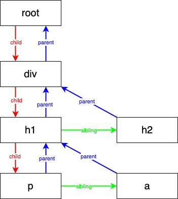

<!--
 * Author  rhys.zhao
 * Date  2023-06-20 14:06:37
 * LastEditors  rhys.zhao
 * LastEditTime  2023-06-21 20:04:44
 * Description
-->

# Fiber

## 什么是 Fiber

前面说过要将工作拆分成一个个小单元，也就是 Fiber。什么是 Fiber?

**Fiber 既是一种数据结构，也是一个工作单元。**

比如要渲染这样一个 JSX:

```js
miniReact.render(
  <div>
    <h1>
      <p />
      <a />
    </h1>
    <h2 />
  </div>,
  container
);
```

则 对应的 fiber 树是这样的结构：



其实 **fiber 树就是一个链表**。渲染过程中，**一个节点就是一个工作单元**。渲染中它的执行过程如下：

1. 从 root 开始，找到第一个子节点 div
2. div 找到第一个子节点 h1
3. h1 找到第一个子节点 p
4. p 没有子节点，于是找自己的兄弟节点 a
5. a 没有子节点，也没有兄弟节点，于是找自己的父节点的兄弟节点 h2
6. h2 没有子节点，没有兄弟节点，也没有父节点的兄弟节点，于是继续向上找，直到 root。root 的父节点为 null,渲染完毕。

整个渲染过程，其实就是 **按照 第一个子节点 -> 兄弟节点 -> 父节点的兄弟节点 的优先级顺序来渲染的**。

## 实现

首先，我们把 render 函数里创建 dom 的代码抽离成一个函数 `createDom`。

```js
function createDom(fiber) {
  const dom = fiber.type === 'TEXT_ELEMENT' ? document.createTextNode('') : document.createElement(fiber.type);
  Object.keys(fiber.props).forEach((key) => {
    if (key !== 'children') {
      dom[key] = fiber.props[key];
    }
  });
  return dom;
}
```

接下来，我们梳理一下各个函数要做的工作：

```js
// ...
let nextWorkUnit = null;
function render(element, container) {
  // todo: 指定container为第一个fiber(也就是nextWorkUnit)
}

function performUnitOfWork(fiber) {
  // todo: 将fiber的dom添加到父fiber的dom上
  // todo: 为fiber的子元素创建fiber, fiber要有三个属性 parent, child, sibling
  // todo: 返回下一个工作单元(下一个fiber)
}
// ...
```

然后，我们根据 todo 完善代码, 完整代码如下：

```js{15-19,23-65}
// react-dom.js
let nextWorkUnit = null;

function createDom(fiber) {
  const dom = fiber.type === 'TEXT_ELEMENT' ? document.createTextNode('') : document.createElement(fiber.type);
  Object.keys(fiber.props).forEach((key) => {
    if (key !== 'children') {
      dom[key] = fiber.props[key];
    }
  });
  return dom;
}

function render(element, container) {
  // 指定container为第一个fiber(也就是nextWorkUnit)
  nextWorkUnit = {
    dom: container,
    props: { children: [element] }
  };
}

function performUnitOfWork(fiber) {
  // 将fiber的dom添加到父fiber的dom上
  if (!fiber.dom) {
    fiber.dom = createDom(fiber);
  }
  if (fiber.parent) {
    fiber.parent.dom.appendChild(fiber.dom);
  }

  // 为fiber的子元素创建fiber
  let children = fiber.props.children;
  let prevSibling = null; // 上一个兄弟节点

  for (let i = 0; i < children.length; i++) {
    let newFiber = {
      type: children[i].type,
      props: children[i].props,
      parent: fiber,
      dom: null
    };
    // 第一个子fiber指定为其parent的child，其他子fiber通过sibling链起来
    if (i === 0) {
      fiber.child = newFiber;
      prevSibling = newFiber;
    } else {
      prevSibling.sibling = newFiber;
    }
  }

  // 返回下一个工作单元(下一个fiber)
  if (fiber.child) {
    // 下一个工作单元优先是子fiber
    return fiber.child;
  }

  let nextFiber = fiber;

  // 下一个工作单元是兄弟fiber，兄弟fiber为空就找父fiber的兄弟fiber，直到根fiber为止
  while (nextFiber) {
    if (nextFiber.sibling) {
      return nextFiber.sibling;
    }
    nextFiber = nextFiber.parent;
  }
}

function workLoop(deadline) {
  while (nextWorkUnit && deadline.timeRemaining() > 1) {
    nextWorkUnit = performUnitOfWork(nextWorkUnit);
  }
  requestIdleCallback(workLoop);
}

requestIdleCallback(workLoop);

export default { render };
```

至此，我们通过 fiber 实现了 ReactDOM.render 的功能。不出意外的话，浏览器应该能够正常显示 `hello world!`。
