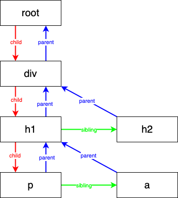

<!--
 * Author  rhys.zhao
 * Date  2023-06-20 14:08:15
 * LastEditors  rhys.zhao
 * LastEditTime  2023-06-27 17:22:55
 * Description
-->

# Reconciler

现在我们来总结一下前面所做的事情：


**1. 递归调用渲染**

通过递归调用 render 的方式创建、操作 DOM 等方式把 JSX 显示到页面上。

缺点：递归不能中断，递归过程会占用浏览器主线程，造成卡帧。

**2. Fiber 架构**

将渲染操作拆分成一个个工作单元(Fiber 节点), 将不能中断的递归操作变成可中断的异步操作, 解决了卡帧的问题。

缺点：创建、操作 DOM 的工作(commit)在一个个工作单元里，导致整个页面是一点点显示出来的。

**3. 分离 render 和 commit**

将渲染操作拆分成 render 和 commit。render 负责将 React 相关操作(Fiber 创建和执行)，commit 负责浏览器相关操作(`createElement`, `appendChild` 等操作)。保证了浏览器渲染过程的连贯。

**4. Reconciler**

协调器，主要是通过 diff 算法来提高**页面更新**性能。这是我们接下来要做的事情。

## 为什么要 diff

前面说过 commit 效率很高，为什么还要 diff 呢？每次都重新渲染不行吗？

这主要出于两种考虑：

1. 开发中的 React 应用通常是个非常大的 JSX 树。每次都重新 render 开销是非常大的。

2. 每次一个小的更新，页面都要重新 render、commit。每次 commit 相当于整个页面重新生成了一遍，就好比刷新了页面。用户体验较差。

3. 一般应用会渲染一次，更多的是更新和删除 fiber 节点。

## 分析

首先我们先分析下之前 `performUnitOfWork` 做的事情：

判断是否有 dom, 若无则创建 => 给节点创建 Fiber => 返回下一个 Fiber



对于上面这个图来说：

1. 执行 root Fiber => 给 div 创建 Fiber => 返回 div
2. 执行 div Fiber => 给 h1、h2 创建 Fiber => 返回 h1
3. 执行 h1 Fiber => 给 p、a 创建 Fiber => 返回 p
4. 执行 p Fiber => p 没有子节点，不再创建 Fiber => 返回 a
5. 执行 a Fiber => a 没有子节点，不再创建 Fiber => 返回 h2
6. 执行 h2 Fiber => h2 没有子节点，不再创建 Fiber => 返回 null

也就是说，生成 Fiber 每次都是生成当前 Fiber 的子节点。执行 Fiber 是按照深度优先遍历的顺序执行的。

既然要 diff，肯定要跟上一次的 Fiber 树做 diff。

### 1. 保存上一次的 Fiber 树

我们用一个 `currentRoot` 变量来保存上一次的 Fiber 树。

每次 commit 的时候，用 `currentRoot` 来存储 `wipRoot`。

等下次渲染的时候，把 `currentRoot` 保存到下一个 `wipRoot` 的 `alternate` 属性里。

```js{1,7,16}
let currentRoot = null;

function render(element, container) {
  wipRoot = {
    dom: container,
    props: { children: [element] },
    alternate: currentRoot // 将上一次的Fiber树保存到alternate属性里
  };
  nextWorkUnit = wipRoot;
}

// ...
function commitRoot() {
  commitWork(wipRoot.child);

  currentRoot = wipRoot; // 用currentRoot来存储上一次的Fiber树
  wipRoot = null;
}
```

### 2. 前后两次 Fiber 做比较
