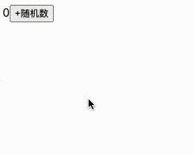

<!--
 * Author  rhys.zhao
 * Date  2023-06-02 09:55:37
 * LastEditors  rhys.zhao
 * LastEditTime  2023-06-02 17:46:15
 * Description
-->

# useMemo

useMemo 允许我们**缓存一个计算结果**。当再次渲染的时候，返回上一次的结果而不是重新计算。

## 语法

`const cachedValue = useMemo(calculateValue, dependencies)`

- `calculateValue`: 缓存的计算结果。 当它是一个函数时，会缓存这个函数的返回值。

- `dependencies`: 依赖项。当依赖项变化时，重新计算结果。

## 使用场景

1. 防止组件重新渲染

比如前面的[例子](https://codesandbox.io/s/memo-yin-yong-lei-xing-gxdfqt?file=/src/App.js):

当 prop 是对象、数组或函数的情况，这时候可以使用 useMemo 配合 memo 缓存组件。

2. 避免昂贵的计算

比如下面这个[例子](https://codesandbox.io/s/expensive-usememo-s3c1zo?file=/src/App.js)

```js
import React, { useState, useMemo } from 'react';

export default function App() {
  const [count, setCount] = useState(0);

  // 模拟复杂的运算，需要两秒钟
  const getResult = async () => {
    await new Promise((resolve) => {
      setTimeout(() => resolve(), 2000);
    });
    return 2;
  };

  const onAddCount = async () => {
    const result = await getResult();
    setCount((count) => count + result);
  };

  return (
    <>
      <span>{count}</span>
      <button onClick={onAddCount}>+随机数</button>
    </>
  );
}
```

`getResult` 是一个耗时的计算，需要两秒钟。这就会导致我们每次点击按钮，都要等待两秒才能响应。如果我们使用 useMemo 缓存结果，那么只有第一次需要等待两秒，后面都会快速响应。

```js
import React, { useState, useMemo } from 'react';

export default function App() {
  const [count, setCount] = useState(0);

  // 使用useMemo缓存复杂的计算结果
  const getResult = useMemo(async () => {
    await new Promise((resolve) => {
      setTimeout(() => resolve(), 2000);
    });
    return 2;
  }, []);

  const onAddCount = async () => {
    // 使用useMemo直接缓存计算结果，getResult是结果不是函数
    const result = await getResult;
    setCount((count) => count + result);
  };

  return (
    <>
      <span>{count}</span>
      <button onClick={onAddCount}>+随机数</button>
    </>
  );
}
```

使用 useMemo 前的效果：


使用 useMemo 后的效果：


